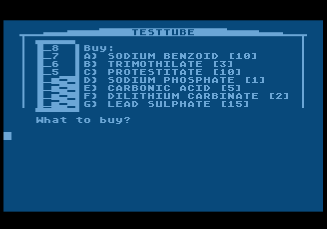

# Testtube
An unfinished game for Atari 8-bit computers in Atari BASIC, that I wrote in high school circa 1988

Here's TESTTUBE, a sort of half-idea of an archemist game. You could combine chemicals in a test tube to try to make money. Unfortunately there's no strategy or way to know how to win. Clues were supposed to be scattered around a BBS.
